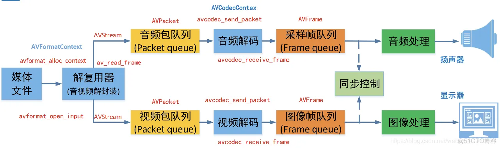
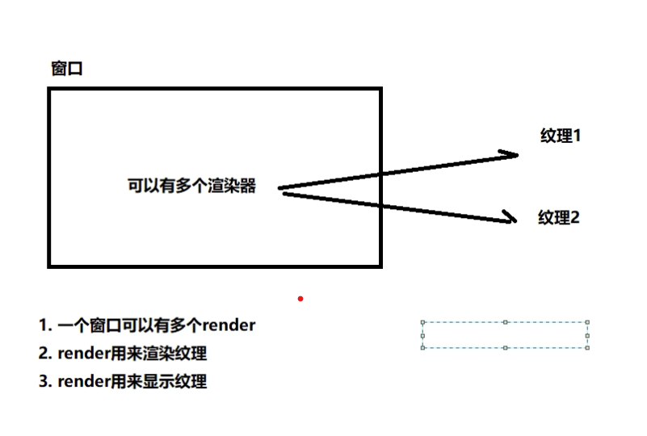
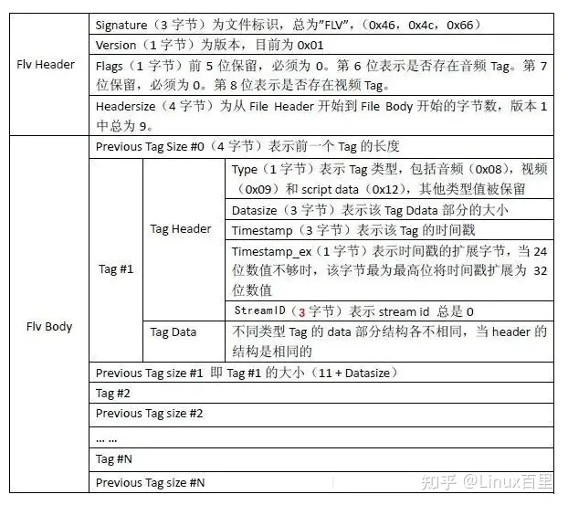

# <center>音视频学习笔记 </center>

## 零、 vscode

### 配置cmake
在c_cpp_properties.json中加入这一行

`"configurationProvider": "ms-vscode.cmake-tools"`

### WORKING_DIRECTORY
`set_target_properties(${EXECUTABLES} PROPERTIES WORKING_DIRECTORY ${CMAKE_SOURCE_DIR} RUNTIME_OUTPUT_DIRECTORY ${CMAKE_SOURCE_DIR})
`

## 一、 FFmpeg

### ffmpeg九宫格

```powershell
ffmpeg -i 1.mp4 -i 1.mp4 -i 1.mp4 -i 1.mp4 -filter_complex "nullsrc=size=1280x720[base];[0:v]setpts=PTS-STARTPTS,scale=640x360[lu];[1:v]setpts=PTS-STARTPTS,scale=640x360[ru];[2:v]setpts=PTS-STARTPTS,scale=640x360[ld];[3:v]setpts=PTS-STARTPTS,scale=640x360[rd];[base][lu]overlay=shortest=1[tmp1];[tmp1][ru]overlay=shortest=1:x=640[tmp2];[tmp2][ld]overlay=shortest=1:y=360[tmp3];[tmp3][rd]overlay=shortest=1:x=640:y=360" -y out.mp4
```

### FFmpeg内存模型



### AVPacket 相关

```c
AVPacket *av_packet_alloc(void);
void av_packet_free(AVPacket **pkt);
AVPacket *av_packet_clone(const AVPacket *src);
int av_new_packet(AVPacket *pkt, int size);
int av_packet_ref(AVPacket *dst, const AVPacket *src);
void av_packet_unref(AVPacket *pkt);
void av_packet_move_ref(AVPacket *dst, AVPacket *src);
int av_packet_make_refcounted(AVPacket *pkt);
```
流程在[test1](src/ffmpegTester.cpp)中

### AVFormat 相关

```c
int avformat_open_input(AVFormatContext **ps, const char *url,
                        const AVInputFormat *fmt, AVDictionary **options);
void av_dump_format(AVFormatContext *ic,
                    int index,
                    const char *url,
                    int is_output);
AVPacket *av_packet_alloc(void);
int av_read_frame(AVFormatContext *s, AVPacket *pkt);
int av_seek_frame(AVFormatContext *s, int stream_index, int64_t timestamp, int flags);
```

### AVBitStreamFilter 相关

```c
// Query
const AVBitStreamFilter *av_bsf_next(void **opaque);
const AVBitStreamFilter *av_bsf_get_by_name(const char *name);

// Setup
int av_bsf_alloc(const AVBitStreamFilter *filter, AVBSFContext **ctx);
int av_bsf_init(AVBSFContext *ctx);

// Usage
// 会移动pkt到bsf内部
int av_bsf_send_packet(AVBSFContext *ctx, AVPacket *pkt);
// 会将数据从bsf内部移动到pkt
int av_bsf_receive_packet(AVBSFContext *ctx, AVPacket *pkt);

// Cleanup
void av_bsf_free(AVBSFContext **ctx);
```
在[test3](src/ffmpegTester.cpp)中

### AAC提取PCM

[AAC提取PCM](https://blog.csdn.net/m0_37599645/article/details/112286537)

在[parse_pcm.cpp](src/parse_pcm.cpp)中

播放：`ffplay -ar 48000 -ac 2 -f f32le test.pcm`

### H264提取YUV420P

[H264提取YUV420P](https://blog.csdn.net/asdasfdgdhh/article/details/109777820)

在[parse_yuv420p.cpp](src/parse_yuv.cpp)中

播放: `ffplay -pixel_format yuv420p -video_size 1280x720  -i test.yuv`


## 二、 SDL

直接下载[SDL2](https://github.com/libsdl-org/SDL/releases)，然后用cmake引入就可以使用



## 三、 格式

### FLV



[FlvParser](https://blog.csdn.net/weixin_41643938/article/details/124537035)


### MP4

[MP4格式分析](https://zhuanlan.zhihu.com/p/355803589)

#### 获取mp4文件的帧率fps

[hexinator文件](README/video_mp4_hex.txt)

[mediainfo文件](README/video_mp4_mediainfo.txt)

1.帧率(每帧播放的时间) = 电影的总时间duration/(电影的总帧数*时间刻度timescale)

2.电影的总时间duration获取和时间刻度timescale的获取：

mvhd Box

00 00 00 6C:  size,mvhd Box的大小为108个字节

6D 76 68 64:  mvhd

00 00 00 00:  version,flags

BE EE 87 C5:  creation-time创建文件的时间,是距离1904年1月1日0点的秒数

BE EE 87 C5:  modifiation-time修改文件的时间，

00 01 5F 90:  timescale时标，时间刻度的单位，为1/90 000秒

01 A8 61 B8:  duration持续的timescale

00 01 00 00:  rate播放描述的等级

01 00:    volume播放时的音量


3.电影的总帧数获取

00 00 00 14:  size of stsz,20

73 74 73 7A:  stsz

00 00 00 00:  version

00 00 00 12:  sample-size

00 00 00 01:  总帧数

4.电影的一帧播放时长

DAFBF        Name:                            stts

DAFC3       Version:                          0 (0x00)

DAFC4       Flags:                            0 (0x000000)

DAFC7       Number of entries:                1 (0x00000001)

DAFCB       Sample Count:                     250 (0x000000FA)

DAFCF       Sample Duration:                  512 (0x00000200)

**Sample Duration/Time Scale = 512/128000 = 0.04秒**