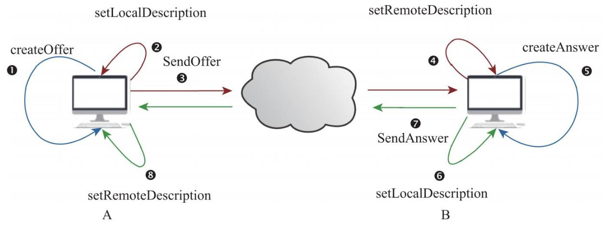

# <center>音视频学习笔记 </center>

## 零、 vscode

### 配置cmake
在c_cpp_properties.json中加入这一行

`"configurationProvider": "ms-vscode.cmake-tools"`

### WORKING_DIRECTORY
`set_target_properties(${EXECUTABLES} PROPERTIES WORKING_DIRECTORY ${CMAKE_SOURCE_DIR} RUNTIME_OUTPUT_DIRECTORY ${CMAKE_SOURCE_DIR})
`

## 一、 FFmpeg

### FFmpeg examples

[FFmpeg examples](https://ffmpeg.org/doxygen/trunk/examples.html)

### ffmpeg九宫格

```powershell
ffmpeg -i 1.mp4 -i 1.mp4 -i 1.mp4 -i 1.mp4 -filter_complex "nullsrc=size=1280x720[base];[0:v]setpts=PTS-STARTPTS,scale=640x360[lu];[1:v]setpts=PTS-STARTPTS,scale=640x360[ru];[2:v]setpts=PTS-STARTPTS,scale=640x360[ld];[3:v]setpts=PTS-STARTPTS,scale=640x360[rd];[base][lu]overlay=shortest=1[tmp1];[tmp1][ru]overlay=shortest=1:x=640[tmp2];[tmp2][ld]overlay=shortest=1:y=360[tmp3];[tmp3][rd]overlay=shortest=1:x=640:y=360" -y out.mp4
```

### FFmpeg内存模型


### AVPacket 相关

```c
AVPacket *av_packet_alloc(void);
void av_packet_free(AVPacket **pkt);
AVPacket *av_packet_clone(const AVPacket *src);
int av_new_packet(AVPacket *pkt, int size);
int av_packet_ref(AVPacket *dst, const AVPacket *src);
void av_packet_unref(AVPacket *pkt);
void av_packet_move_ref(AVPacket *dst, AVPacket *src);
int av_packet_make_refcounted(AVPacket *pkt);
```
流程在[test1](src/ffmpegTester.cpp)中

### AVFormat 相关

```c
int avformat_open_input(AVFormatContext **ps, const char *url,
                        const AVInputFormat *fmt, AVDictionary **options);
void av_dump_format(AVFormatContext *ic,
                    int index,
                    const char *url,
                    int is_output);
AVPacket *av_packet_alloc(void);
int av_read_frame(AVFormatContext *s, AVPacket *pkt);
int av_seek_frame(AVFormatContext *s, int stream_index, int64_t timestamp, int flags);
```

### AVBitStreamFilter 相关

```c
// Query
const AVBitStreamFilter *av_bsf_next(void **opaque);
const AVBitStreamFilter *av_bsf_get_by_name(const char *name);

// Setup
int av_bsf_alloc(const AVBitStreamFilter *filter, AVBSFContext **ctx);
int av_bsf_init(AVBSFContext *ctx);

// Usage
// 会移动pkt到bsf内部
int av_bsf_send_packet(AVBSFContext *ctx, AVPacket *pkt);
// 会将数据从bsf内部移动到pkt
int av_bsf_receive_packet(AVBSFContext *ctx, AVPacket *pkt);

// Cleanup
void av_bsf_free(AVBSFContext **ctx);
```
在[test3](src/ffmpegTester.cpp)中

### AAC提取PCM

[AAC提取PCM](https://blog.csdn.net/m0_37599645/article/details/112286537)

在[parse_pcm.cpp](src/parse_pcm.cpp)中

播放：`ffplay -ar 48000 -ac 2 -f f32le test.pcm`

### H264提取YUV420P

[H264提取YUV420P](https://blog.csdn.net/asdasfdgdhh/article/details/109777820)

在[parse_yuv420p.cpp](src/parse_yuv420p.cpp)中

播放: `ffplay -pixel_format yuv420p -video_size 1280x720  -i test.yuv`

### 使用AVIO

[AVIO](https://zhuanlan.zhihu.com/p/501294281)

在[07-09-avio.c](src/07-09-avio.c)中

```c
AVIOContext *avio_alloc_context(
                  unsigned char *buffer,
                  int buffer_size,
                  int write_flag,
                  void *opaque,
                  int (*read_packet)(void *opaque, uint8_t *buf, int buf_size),
                  int (*write_packet)(void *opaque, uint8_t *buf, int buf_size),
                  int64_t (*seek)(void *opaque, int64_t offset, int whence));


//创建AVIOContext
AVIOContext *avio_ctx = avio_alloc_context(inbuf, AUDIO_INBUF_SIZE, 0, (void *)in_file, (void *)&read_file, NULL, NULL);


AVFormatContext *fmt_ctx = avformat_alloc_context();
fmt_ctx->pb = avio_ctx;
// 不需要手动设置，avformat_open_input会自动设置
// fmt_ctx->flags |= AVFMT_FLAG_CUSTOM_IO;


// 调用av_read_frame和avformat_open_input时，会自动调用avio_ctx->read_packet
// 可以在read_packet函数中从内存读取数据
ret = avformat_open_input(&fmt_ctx, NULL, NULL, NULL);
ret = av_read_frame(fmt_ctx, pkt);

// 必须这样释放，否则会内存泄漏
// 自定义avio不会把里面的pb释放掉
// fmt_ctx会free掉
avformat_close_input(&fmt_ctx);

/* note: the internal buffer could have changed, and be != avio_ctx_buffer */
if (avio_ctx)
    av_freep(&avio_ctx->buffer);
avio_context_free(&avio_ctx);

```

### 音频重采样

[resample_audio.c](src/resample_audio.c)

```c
/**
 * Gets the delay the next input sample will experience relative to the next output sample.
 *
 * Swresample can buffer data if more input has been provided than available
 * output space, also converting between sample rates needs a delay.
 * This function returns the sum of all such delays.
 * The exact delay is not necessarily an integer value in either input or
 * output sample rate. Especially when downsampling by a large value, the
 * output sample rate may be a poor choice to represent the delay, similarly
 * for upsampling and the input sample rate.
 *
 * @param s     swr context
 * @param base  timebase in which the returned delay will be:
 *              @li if it's set to 1 the returned delay is in seconds
 *              @li if it's set to 1000 the returned delay is in milliseconds
 *              @li if it's set to the input sample rate then the returned
 *                  delay is in input samples
 *              @li if it's set to the output sample rate then the returned
 *                  delay is in output samples
 *              @li if it's the least common multiple of in_sample_rate and
 *                  out_sample_rate then an exact rounding-free delay will be
 *                  returned
 * @returns     the delay in 1 / @c base units.
 */
int64_t swr_get_delay(struct SwrContext *s, int64_t base);

/**
 * @}
 *
 * @name Core conversion functions
 * @{
 */

/** Convert audio.
 *
 * in and in_count can be set to 0 to flush the last few samples out at the
 * end.
 *
 * If more input is provided than output space, then the input will be buffered.
 * You can avoid this buffering by using swr_get_out_samples() to retrieve an
 * upper bound on the required number of output samples for the given number of
 * input samples. Conversion will run directly without copying whenever possible.
 *
 * @param s         allocated Swr context, with parameters set
 * @param out       output buffers, only the first one need be set in case of packed audio
 * @param out_count amount of space available for output in samples per channel
 * @param in        input buffers, only the first one need to be set in case of packed audio
 * @param in_count  number of input samples available in one channel
 *
 * @return number of samples output per channel, negative value on error
 */
int swr_convert(struct SwrContext *s, uint8_t **dst_data, int dst_nb_samples,
                                const uint8_t **src_data , int src_nb_samples);

// 每次调用swr_convert时，都会返回一个size，这个size<=dst_nb_samples，于是，需要调用swr_get_delay加到src_nb_samples上以获取更多的dst_nb_samples
// 这样下次一调用swr_convert时，dst_nb_samples就会增加
int64_t delay = swr_get_delay(swr_ctx, src_rate);
        dst_nb_samples = av_rescale_rnd( delay+
                                        src_nb_samples, dst_rate, src_rate, AV_ROUND_UP);
ret = swr_convert(swr_ctx, dst_data, dst_nb_samples, (const uint8_t **)src_data, src_nb_samples);

swr_convert(swr_ctx, dst_data, dst_nb_samples, NULL, 0);可以flush剩余的数据

```


### 编码PCM

[encode_pcm_aac.c](src/encode_pcm_aac.c)

```c
// 这项要和源文件的采样率一致，不然编码后的aac文件会出现变速的情况
c->sample_rate =select_sample_rate(codec);
//例如使用 ffmpeg -i video.mp4 -vn -ar 44100 -ac 2 -f f32le test.pcm 编码时，需要设置 c->sample_rate = 44100;

// 此函数会正确的设置frame->data指向in_tmp_buf中对应的位置
av_samples_fill_arrays(frame->data, frame->linesize, in_tmp_buf, frame->ch_layout.nb_channels, frame->nb_samples, frame->format, 0);

// 使用ffplay test.aac就可以播放了，不需要指定参数

```


### 编码yuv420p

提取yuv:
`ffmpeg -i video.mp4 -c:v rawvideo -pix_fmt yuv420p test_yuv420p_1280x720.yuv`

播放yuv:
`ffplay -f rawvideo -pixel_format yuv420p -video_size 1280x720 .\test_yuv420p_1280x720.yuv`

[encode_video](src/encode_video.c)


### 合成音频和视频到flv

[mux](src/mux.c)

I find a problem in the example file mux.c, I need some help about modifing the codec of a muxer

```c
// 直接赋值是不可以的，要转成完整的FFOutputFormat再进行修改

typedef struct FFOutputFormat {
    AVOutputFormat p;
    int priv_data_size;
    int flags_internal;
    int (*write_header)(AVFormatContext *);
    int (*write_packet)(AVFormatContext *, AVPacket *pkt);
    int (*write_trailer)(AVFormatContext *);
    int (*interleave_packet)(AVFormatContext *s, AVPacket *pkt,
                            int flush, int has_packet);
    int (*query_codec)(enum AVCodecID id, int std_compliance);
    void (*get_output_timestamp)(AVFormatContext *s, int stream,
                                int64_t *dts, int64_t *wall);
    int (*control_message)(AVFormatContext *s, int type,
                        void *data, size_t data_size);
    int (*write_uncoded_frame)(AVFormatContext *, int stream_index,
                            struct AVFrame **frame, unsigned flags);
    int (*get_device_list)(AVFormatContext *s, struct AVDeviceInfoList *device_list);
    int (*init)(AVFormatContext *);
    void (*deinit)(AVFormatContext *);
    int (*check_bitstream)(AVFormatContext *s, AVStream *st,
                        const AVPacket *pkt);
} FFOutputFormat;
// The filename is xxx.flv
// The default codec for flv is AV_CODEC_ID_ADPCM_SWF and AV_CODEC_ID_FLV1
// If I want to modify the codec I need to copy the entire value of return pointer of av_guess_format() like this, since it returns a const pointer
// If I modify the codec like this, it will cause a segmentation fault when I call avformat_write_header(), because it didn't copy the write_header function pointer in private fileds
AVOutputFormat av_flv_format;
av_flv_format = *(AVOutputFormat*)av_guess_format(NULL, filename, NULL);
av_flv_format.audio_codec = AV_CODEC_ID_AAC;
av_flv_format.video_codec = AV_CODEC_ID_H264;

// Then I try to copy the whole FFOutputFormat to modify the codec
// Because I can't include the mux.h file so I need to copy the definition of FFOutputFormat
FFOutputFormat ff_flv_format;
ff_flv_format = *(FFOutputFormat*)av_guess_format(NULL, filename, NULL);
ff_flv_format.p.audio_codec = AV_CODEC_ID_AAC;
ff_flv_format.p.video_codec = AV_CODEC_ID_H264;
// At this time, it works
avformat_alloc_output_context2(&oc,&ff_flv_format, NULL, filename);
// what should I do if I want to modify the codec?
```

### Decoder

对于视频解码器来说，解码之前好像无法得知视频的format

可以通过`avformat_find_stream_info`来查找视频的信息，这个函数会读取视频的一部分数据，然后解析出视频的format


### 合成MP4

[mux.c](src/mux.c)

## 二、 SDL

直接下载[SDL2](https://github.com/libsdl-org/SDL/releases)，然后用cmake引入就可以使用


## 三、 格式

### FLV


[FlvParser](https://blog.csdn.net/weixin_41643938/article/details/124537035)


### MP4

[MP4格式分析](https://zhuanlan.zhihu.com/p/355803589)

#### 获取mp4文件的帧率fps

[hexinator文件](README/video_mp4_hex.txt)

[mediainfo文件](README/video_mp4_mediainfo.txt)

1.帧率(每帧播放的时间) = 电影的总时间duration/(电影的总帧数*时间刻度timescale)

2.电影的总时间duration获取和时间刻度timescale的获取：

mvhd Box

00 00 00 6C:  size,mvhd Box的大小为108个字节

6D 76 68 64:  mvhd

00 00 00 00:  version,flags

BE EE 87 C5:  creation-time创建文件的时间,是距离1904年1月1日0点的秒数

BE EE 87 C5:  modifiation-time修改文件的时间，

00 01 5F 90:  timescale时标，时间刻度的单位，为1/90 000秒

01 A8 61 B8:  duration持续的timescale

00 01 00 00:  rate播放描述的等级

01 00:    volume播放时的音量


3.电影的总帧数获取

00 00 00 14:  size of stsz,20

73 74 73 7A:  stsz

00 00 00 00:  version

00 00 00 12:  sample-size

00 00 00 01:  总帧数

4.电影的一帧播放时长

DAFBF        Name:                            stts

DAFC3       Version:                          0 (0x00)

DAFC4       Flags:                            0 (0x000000)

DAFC7       Number of entries:                1 (0x00000001)

DAFCB       Sample Count:                     250 (0x000000FA)

DAFCF       Sample Duration:                  512 (0x00000200)

**Sample Duration/Time Scale = 512/128000 = 0.04秒**

## 四、 协议

### HLS(Http Live Streaming) 协议、TS流、M3U8文件

[HLS specification](https://datatracker.ietf.org/doc/html/draft-pantos-http-live-streaming-23)

[HLS 简介](https://zhuanlan.zhihu.com/p/608628539)

[TS 文件格式](https://blog.csdn.net/andylao62/article/details/120019483)

## 五、 SRS

### 播放HLS

使用http的端口播放（8080）m3u8文件，例如：`http://localhost:8080/live/livestream.m3u8`

使用listen端口通过rtmp传输文件，例如：`ffmpeg -i test.mp4 -c copy -f flv rtmp://localhost:1935/live/livestream`

### 推流rtmp 
`ffmpeg -re -stream_loop -1 -i sync-aac.flv -f flv -c copy -flvflags no_duration_filesize rtmp://127.0.0.1:19353/live/stream`

## 六、webRTC


### ICE


### 打开coturn和singal服务器

`turnserver -c /root/turnserver.conf`
`node LearnWebRtc/multiple/server/server.js`

### janus

[Janus](https://janus.conf.meetecho.com/docs/)

#### 发现的问题

janus 的videoroom插件在attach时不会接收candidate，怀疑直接使用sdp的ip地址

设置janus服务端的stun服务器后janus发回的sdp如下，有一个srflx类型的candidate

```
v=0
o=- 2077340275299469257 2 IN IP4 47.236.111.105
s=VideoRoom 1234
t=0 0
a=group:BUNDLE 0 1
a=ice-options:trickle
a=fingerprint:sha-256 CD:BC:F8:83:5B:5E:5D:7F:5D:41:7B:DF:91:1C:D5:25:5D:AE:B2:D7:8D:A1:E6:74:CE:09:72:90:E7:12:FD:A4
a=extmap-allow-mixed
a=msid-semantic: WMS *
m=audio 9 UDP/TLS/RTP/SAVPF 111
c=IN IP4 47.236.111.105
a=recvonly
a=mid:0
a=rtcp-mux
a=ice-ufrag:saYH
a=ice-pwd:7PsJRtq9vFeA5HFeeIddBx
a=ice-options:trickle
a=setup:active
a=rtpmap:111 opus/48000/2
a=fmtp:111 useinbandfec=1
a=extmap:1 urn:ietf:params:rtp-hdrext:ssrc-audio-level
a=extmap:4 urn:ietf:params:rtp-hdrext:sdes:mid
a=msid:janus janus0
a=ssrc:2815377430 cname:janus
a=candidate:1 1 udp 2015363327 172.17.10.191 51267 typ host
a=candidate:2 1 udp 1679819007 47.236.111.105 51267 typ srflx raddr 172.17.10.191 rport 51267
a=end-of-candidates
m=video 9 UDP/TLS/RTP/SAVPF 96 97
c=IN IP4 47.236.111.105
a=recvonly
a=mid:1
a=rtcp-mux
a=ice-ufrag:saYH
a=ice-pwd:7PsJRtq9vFeA5HFeeIddBx
a=ice-options:trickle
a=setup:active
a=rtpmap:96 VP8/90000
a=rtcp-fb:96 ccm fir
a=rtcp-fb:96 nack
a=rtcp-fb:96 nack pli
a=rtcp-fb:96 goog-remb
a=rtcp-fb:96 transport-cc
a=extmap:13 urn:3gpp:video-orientation
a=extmap:3 http://www.ietf.org/id/draft-holmer-rmcat-transport-wide-cc-extensions-01
a=extmap:5 http://www.webrtc.org/experiments/rtp-hdrext/playout-delay
a=extmap:4 urn:ietf:params:rtp-hdrext:sdes:mid
a=extmap:10 urn:ietf:params:rtp-hdrext:sdes:rtp-stream-id
a=extmap:11 urn:ietf:params:rtp-hdrext:sdes:repaired-rtp-stream-id
a=rtpmap:97 rtx/90000
a=fmtp:97 apt=96
a=msid:janus janus1
a=ssrc:692893090 cname:janus
a=candidate:1 1 udp 2015363327 172.17.10.191 51267 typ host
a=candidate:2 1 udp 1679819007 47.236.111.105 51267 typ srflx raddr 172.17.10.191 rport 51267
a=end-of-candidates
```

关闭stun服务器后，janus发回的sdp如下，没有srflx类型的candidate，且ip地址为内网地址

```
v=0
o=- 1456016224506848041 2 IN IP4 172.17.10.191
s=VideoRoom 1234
t=0 0
a=group:BUNDLE 0 1
a=ice-options:trickle
a=fingerprint:sha-256 5E:20:5A:34:AE:29:B1:DD:5E:9F:C2:22:FC:91:12:10:10:95:99:F3:47:D2:BF:24:DC:78:C5:C1:F2:AC:70:44
a=extmap-allow-mixed
a=msid-semantic: WMS *
m=audio 9 UDP/TLS/RTP/SAVPF 111
c=IN IP4 172.17.10.191
a=recvonly
a=mid:0
a=rtcp-mux
a=ice-ufrag:dDZ6
a=ice-pwd:P0IuEvH3YfF59ERxuE4qbl
a=ice-options:trickle
a=setup:active
a=rtpmap:111 opus/48000/2
a=fmtp:111 useinbandfec=1
a=extmap:1 urn:ietf:params:rtp-hdrext:ssrc-audio-level
a=extmap:4 urn:ietf:params:rtp-hdrext:sdes:mid
a=msid:janus janus0
a=ssrc:2788979193 cname:janus
a=candidate:1 1 udp 2015363327 172.17.10.191 51572 typ host
a=end-of-candidates
m=video 9 UDP/TLS/RTP/SAVPF 96 97
c=IN IP4 172.17.10.191
a=recvonly
a=mid:1
a=rtcp-mux
a=ice-ufrag:dDZ6
a=ice-pwd:P0IuEvH3YfF59ERxuE4qbl
a=ice-options:trickle
a=setup:active
a=rtpmap:96 VP8/90000
a=rtcp-fb:96 ccm fir
a=rtcp-fb:96 nack
a=rtcp-fb:96 nack pli
a=rtcp-fb:96 goog-remb
a=rtcp-fb:96 transport-cc
a=extmap:13 urn:3gpp:video-orientation
a=extmap:3 http://www.ietf.org/id/draft-holmer-rmcat-transport-wide-cc-extensions-01
a=extmap:5 http://www.webrtc.org/experiments/rtp-hdrext/playout-delay
a=extmap:4 urn:ietf:params:rtp-hdrext:sdes:mid
a=extmap:10 urn:ietf:params:rtp-hdrext:sdes:rtp-stream-id
a=extmap:11 urn:ietf:params:rtp-hdrext:sdes:repaired-rtp-stream-id
a=rtpmap:97 rtx/90000
a=fmtp:97 apt=96
a=msid:janus janus1
a=ssrc:765158755 cname:janus
a=candidate:1 1 udp 2015363327 172.17.10.191 51572 typ host
a=end-of-candidates
```

在配置文件`janus.jcfg`中找到这段话

>Furthermore, you can choose whether Janus should be configured to do full-trickle (Janus also trickles its candidates to users) rather than the default half-trickle (Janus supports trickle candidates from users, but sends its own within the SDP), and whether it should work in ICE-Lite mode (by default it doesn't).

尝试修改`full-trickle`为`true`，并配置stun服务器，效果如下

```
v=0
o=- 2238517461886594705 2 IN IP4 47.236.111.105
s=VideoRoom 1234
t=0 0
a=group:BUNDLE 0 1
a=ice-options:trickle
a=fingerprint:sha-256 B2:04:FF:48:83:21:21:AC:4C:1A:15:27:56:CA:32:CA:96:1F:AF:10:DF:EC:BE:70:83:39:69:AA:99:46:3D:2E
a=extmap-allow-mixed
a=msid-semantic: WMS *
m=audio 9 UDP/TLS/RTP/SAVPF 111
c=IN IP4 47.236.111.105
a=recvonly
a=mid:0
a=rtcp-mux
a=ice-ufrag:LQeb
a=ice-pwd:CPM6wyfahRM7ZhqqJUmfYO
a=ice-options:trickle
a=setup:active
a=rtpmap:111 opus/48000/2
a=fmtp:111 useinbandfec=1
a=extmap:1 urn:ietf:params:rtp-hdrext:ssrc-audio-level
a=extmap:4 urn:ietf:params:rtp-hdrext:sdes:mid
a=msid:janus janus0
a=ssrc:1072793273 cname:janus
m=video 9 UDP/TLS/RTP/SAVPF 96 97
c=IN IP4 47.236.111.105
a=recvonly
a=mid:1
a=rtcp-mux
a=ice-ufrag:LQeb
a=ice-pwd:CPM6wyfahRM7ZhqqJUmfYO
a=ice-options:trickle
a=setup:active
a=rtpmap:96 VP8/90000
a=rtcp-fb:96 ccm fir
a=rtcp-fb:96 nack
a=rtcp-fb:96 nack pli
a=rtcp-fb:96 goog-remb
a=rtcp-fb:96 transport-cc
a=extmap:13 urn:3gpp:video-orientation
a=extmap:3 http://www.ietf.org/id/draft-holmer-rmcat-transport-wide-cc-extensions-01
a=extmap:5 http://www.webrtc.org/experiments/rtp-hdrext/playout-delay
a=extmap:4 urn:ietf:params:rtp-hdrext:sdes:mid
a=extmap:10 urn:ietf:params:rtp-hdrext:sdes:rtp-stream-id
a=extmap:11 urn:ietf:params:rtp-hdrext:sdes:repaired-rtp-stream-id
a=rtpmap:97 rtx/90000
a=fmtp:97 apt=96
a=msid:janus janus1
a=ssrc:2096047487 cname:janus
```

同时接收到candidate：

```
candidate:1 1 udp 2015363327 172.17.10.191 39746 typ host

candidate:2 1 udp 1679819007 47.236.111.105 44183 typ srflx raddr 172.17.10.191 rport 44183
```

表明full-trickle为true时，janus会通过一个别的方式发送自己的candidate，而不是放在sdp里，half-trickle是旧版本的方式，full-trickle是新版本的方式，但是浏览器会兼容旧版本的方式。

#### 附浏览器向服务器发送的sdp

```
v=0
o=- 3669063131454860966 2 IN IP4 127.0.0.1
s=-
t=0 0
a=group:BUNDLE 0 1
a=extmap-allow-mixed
a=msid-semantic: WMS 03c7022e-17e3-4714-8776-c714e8c10b54
m=audio 9 UDP/TLS/RTP/SAVPF 111 63 9 0 8 13 110 126
c=IN IP4 0.0.0.0
a=rtcp:9 IN IP4 0.0.0.0
a=ice-ufrag:vJzz
a=ice-pwd:f7t71vaBr10FPUhiQ1sSmaHT
// ICE候选（candidates）逐个地被收集并发送，而不是等待所有的ICE候选都被收集完毕后再一次性发送。
a=ice-options:trickle
a=fingerprint:sha-256 D0:B5:88:F6:F1:F1:E5:52:15:2C:6D:18:83:08:86:62:66:19:73:88:33:59:3E:0D:80:FD:B8:B2:F9:A4:95:2D
a=setup:actpass
// media stream id
a=mid:0
a=extmap:1 urn:ietf:params:rtp-hdrext:ssrc-audio-level
a=extmap:2 http://www.webrtc.org/experiments/rtp-hdrext/abs-send-time
a=extmap:3 http://www.ietf.org/id/draft-holmer-rmcat-transport-wide-cc-extensions-01
a=extmap:4 urn:ietf:params:rtp-hdrext:sdes:mid
a=sendonly
a=msid:03c7022e-17e3-4714-8776-c714e8c10b54 c4203efc-e7a5-4d6a-8eb2-ffb6b9172748
a=rtcp-mux
a=rtpmap:111 opus/48000/2
a=rtcp-fb:111 transport-cc
a=fmtp:111 minptime=10;useinbandfec=1
// 可供选择的使用RED FEC机制传输媒体，但是从服务器返回的sdp中可见，服务器并没有选择使用RED FEC机制
a=rtpmap:63 red/48000/2
a=fmtp:63 111/111
a=rtpmap:9 G722/8000
a=rtpmap:0 PCMU/8000
a=rtpmap:8 PCMA/8000
a=rtpmap:13 CN/8000
a=rtpmap:110 telephone-event/48000
a=rtpmap:126 telephone-event/8000
a=ssrc:1073232550 cname:fZJoE+wdrHBTbX8n
a=ssrc:1073232550 msid:03c7022e-17e3-4714-8776-c714e8c10b54 c4203efc-e7a5-4d6a-8eb2-ffb6b9172748
m=video 9 UDP/TLS/RTP/SAVPF 96 97 102 103 104 105 106 107 108 109 127 125 39 40 45 46 98 99 100 101 112 113 116 117 118
c=IN IP4 0.0.0.0
a=rtcp:9 IN IP4 0.0.0.0
a=ice-ufrag:vJzz
a=ice-pwd:f7t71vaBr10FPUhiQ1sSmaHT
a=ice-options:trickle
a=fingerprint:sha-256 D0:B5:88:F6:F1:F1:E5:52:15:2C:6D:18:83:08:86:62:66:19:73:88:33:59:3E:0D:80:FD:B8:B2:F9:A4:95:2D
a=setup:actpass
a=mid:1
a=extmap:14 urn:ietf:params:rtp-hdrext:toffset
a=extmap:2 http://www.webrtc.org/experiments/rtp-hdrext/abs-send-time
a=extmap:13 urn:3gpp:video-orientation
a=extmap:3 http://www.ietf.org/id/draft-holmer-rmcat-transport-wide-cc-extensions-01
a=extmap:5 http://www.webrtc.org/experiments/rtp-hdrext/playout-delay
a=extmap:6 http://www.webrtc.org/experiments/rtp-hdrext/video-content-type
a=extmap:7 http://www.webrtc.org/experiments/rtp-hdrext/video-timing
a=extmap:8 http://www.webrtc.org/experiments/rtp-hdrext/color-space
a=extmap:4 urn:ietf:params:rtp-hdrext:sdes:mid
a=extmap:10 urn:ietf:params:rtp-hdrext:sdes:rtp-stream-id
a=extmap:11 urn:ietf:params:rtp-hdrext:sdes:repaired-rtp-stream-id
a=sendonly
a=msid:03c7022e-17e3-4714-8776-c714e8c10b54 b200839d-8f25-40f2-9dfc-6adcff9d793f
a=rtcp-mux
a=rtcp-rsize
a=rtpmap:96 VP8/90000
a=rtcp-fb:96 goog-remb
a=rtcp-fb:96 transport-cc
a=rtcp-fb:96 ccm fir
a=rtcp-fb:96 nack
a=rtcp-fb:96 nack pli
a=rtpmap:97 rtx/90000
a=fmtp:97 apt=96
a=rtpmap:102 H264/90000
a=rtcp-fb:102 goog-remb
a=rtcp-fb:102 transport-cc
a=rtcp-fb:102 ccm fir
a=rtcp-fb:102 nack
a=rtcp-fb:102 nack pli
a=fmtp:102 level-asymmetry-allowed=1;packetization-mode=1;profile-level-id=42001f
a=rtpmap:103 rtx/90000
a=fmtp:103 apt=102
a=rtpmap:104 H264/90000
a=rtcp-fb:104 goog-remb
a=rtcp-fb:104 transport-cc
a=rtcp-fb:104 ccm fir
a=rtcp-fb:104 nack
a=rtcp-fb:104 nack pli
a=fmtp:104 level-asymmetry-allowed=1;packetization-mode=0;profile-level-id=42001f
a=rtpmap:105 rtx/90000
a=fmtp:105 apt=104
a=rtpmap:106 H264/90000
a=rtcp-fb:106 goog-remb
a=rtcp-fb:106 transport-cc
a=rtcp-fb:106 ccm fir
a=rtcp-fb:106 nack
a=rtcp-fb:106 nack pli
a=fmtp:106 level-asymmetry-allowed=1;packetization-mode=1;profile-level-id=42e01f
a=rtpmap:107 rtx/90000
a=fmtp:107 apt=106
a=rtpmap:108 H264/90000
a=rtcp-fb:108 goog-remb
a=rtcp-fb:108 transport-cc
a=rtcp-fb:108 ccm fir
a=rtcp-fb:108 nack
a=rtcp-fb:108 nack pli
a=fmtp:108 level-asymmetry-allowed=1;packetization-mode=0;profile-level-id=42e01f
a=rtpmap:109 rtx/90000
a=fmtp:109 apt=108
a=rtpmap:127 H264/90000
a=rtcp-fb:127 goog-remb
a=rtcp-fb:127 transport-cc
a=rtcp-fb:127 ccm fir
a=rtcp-fb:127 nack
a=rtcp-fb:127 nack pli
a=fmtp:127 level-asymmetry-allowed=1;packetization-mode=1;profile-level-id=4d001f
a=rtpmap:125 rtx/90000
a=fmtp:125 apt=127
a=rtpmap:39 H264/90000
a=rtcp-fb:39 goog-remb
a=rtcp-fb:39 transport-cc
a=rtcp-fb:39 ccm fir
a=rtcp-fb:39 nack
a=rtcp-fb:39 nack pli
a=fmtp:39 level-asymmetry-allowed=1;packetization-mode=0;profile-level-id=4d001f
a=rtpmap:40 rtx/90000
a=fmtp:40 apt=39
a=rtpmap:45 AV1/90000
a=rtcp-fb:45 goog-remb
a=rtcp-fb:45 transport-cc
a=rtcp-fb:45 ccm fir
a=rtcp-fb:45 nack
a=rtcp-fb:45 nack pli
a=rtpmap:46 rtx/90000
a=fmtp:46 apt=45
a=rtpmap:98 VP9/90000
a=rtcp-fb:98 goog-remb
a=rtcp-fb:98 transport-cc
a=rtcp-fb:98 ccm fir
a=rtcp-fb:98 nack
a=rtcp-fb:98 nack pli
a=fmtp:98 profile-id=0
a=rtpmap:99 rtx/90000
a=fmtp:99 apt=98
a=rtpmap:100 VP9/90000
a=rtcp-fb:100 goog-remb
a=rtcp-fb:100 transport-cc
a=rtcp-fb:100 ccm fir
a=rtcp-fb:100 nack
a=rtcp-fb:100 nack pli
a=fmtp:100 profile-id=2
a=rtpmap:101 rtx/90000
a=fmtp:101 apt=100
a=rtpmap:112 H264/90000
a=rtcp-fb:112 goog-remb
a=rtcp-fb:112 transport-cc
a=rtcp-fb:112 ccm fir
a=rtcp-fb:112 nack
a=rtcp-fb:112 nack pli
a=fmtp:112 level-asymmetry-allowed=1;packetization-mode=1;profile-level-id=64001f
a=rtpmap:113 rtx/90000
a=fmtp:113 apt=112
a=rtpmap:116 red/90000
a=rtpmap:117 rtx/90000
a=fmtp:117 apt=116
a=rtpmap:118 ulpfec/90000
a=ssrc-group:FID 4108419990 4041802237
a=ssrc:4108419990 cname:fZJoE+wdrHBTbX8n
a=ssrc:4108419990 msid:03c7022e-17e3-4714-8776-c714e8c10b54 b200839d-8f25-40f2-9dfc-6adcff9d793f
a=ssrc:4041802237 cname:fZJoE+wdrHBTbX8n
a=ssrc:4041802237 msid:03c7022e-17e3-4714-8776-c714e8c10b54 b200839d-8f25-40f2-9dfc-6adcff9d793f
```

### sdp详解

```
1 // ===============================================
2 // SDP 会话描述
3 // ===============================================
4 // 版本信息
5 v=0
6 // 会话的创建者
7 o=- 8567802084787497323 2 IN IP4 127.0.0.1
8 // 会话名
9 s=-
10 // 会话时长
11 t=0 0
12 // 音视频传输采用多路复用方式， 通过同一个通道传输
13 // 这样可以减少对ICE 资源的消耗
14 a=group:BUNDLE 0 1
15 //WMS(WebRTC Media Stream)
16 // 因为上面的BUNDLE 使得音视频可以复用传输通道
17 // 所以WebRTC 定义一个媒体流来对音视频进行统一描述
18 // 媒体流中可以包含多路轨（ 音频轨、视频轨… … )
19 // 每个轨对应一个SSRC
20 a=msid -semantic: WM S 3eofXQZ24BqbQPRkcL49QddC5s84gauyOuUt
21 // ===============================================
22 // 音视频媒体描述
23 // ===============================================
24 // 音频媒体描述
25 // 端口9 忽略， 端口设置为0 表示不传输音频
26 m=audio 9 UDP/TLS/RTP/SAVPF 111 103 104 9 0 8 106 105 13 110 112 113 126
27 // 网络描述, 忽略!WebRTC 不使用该属性
28 c=IN IP4 0.0.0.0
29 // 忽略!WebRTC 不使用该属性
30 a=rtcp:9 IN IP4 0.0.0.0
31 // 用于ICE 有效用户的验证
32 // ufrag 表示用户名( 随机值)
33 a=ice -ufrag:r8+X
34 // 密码
35 a=ice -pwd:MdLpm2pegfysJ/VMCCGtZRpF
36 // 收信candidate 方式
37 a=ice -options:trickle
38 // 证书指纹， 用于验证DTLS 证书有效性
39 a=fingerprint:sha -256 53:08:1A:66:24: C7 :45:31:0A:EA:9E:59:97: A9 :15:3A:EC :60:1F:85:85:5B:B8:EC:D4 :77:78:9A:46:09:03:2A
40 // 用于指定DTLS 用户角色
41 a=setup:actpass
42 // BUNDLE 使用， 0 表示音频
43 a=mid:0
44 // 音频传输时RTP 支持的扩展头
45 // 发送端是否音频level 扩展， 可参考RFC6464
46 a=extmap :1 urn:ietf:params:rtp -hdrext:ssrc -audio -level
47 //NTP 时间扩展头
48 a=extmap :2 http://www.webrtc.org/experiments/rtp -hdrext/abs -send -time
49 //transport -CC 的扩展头
50 a=extmap :3 http://www.ietf.org/id/draft -holmer -rmcat -transport -wide -cc -extensions -01
51 // 与RTCP 中的SDES(Source Description) 相关的扩展头
52 // 通过RTCP 的SDES 传输mid
53 a=extmap :4 urn:ietf:params:rtp -hdrext:sdes:mid
54 // 通过RTCP 的SDES 传输rtp -stream -id
55 a=extmap :5 urn:ietf:params:rtp -hdrext:sdes:rtp -stream -id
56 // 通过RTCP 的SDES 传输重传时的rtp -stream -id
57 a=extmap :6 urn:ietf:params:rtp -hdrext:sdes:repaired -rtp -stream -id
58 // 音频数据传输方向
59 // sendrecv 既可以接收音频， 又可以发送音频
60 a=sendrecv
61 // 记录音频与媒体流的关系
62 a=msid:3 eofXQZ24BqbQPRkcL49QddC5s84gauyOuUt 67eb8a85 -f7c0 -4cad -bd62 -41 cae9517041
63 //RTCP 与RTP 复用传输通道
64 a=rtcp -mux
65 //PT=111 代表音频编码器opus/ 采样率48000/ 双通道
66 a=rtpmap :111 opus /48000/2
67 // 使用Opus 时， 支持RTCP 中的Transport -CC 反馈报文
68 a=rtcp -fb:111 Transport -cc
69 // 使用Opus 时， 每个视频帧的最小间隔为10ms , 使用带内频率
70 a=fmtp :111 minptime =10; useinbandfec =1
71 //PT=103 代表音频编码器ISAC/ 采样率16000
72 a=rtpmap :103 ISAC /16000
73 //PT=104 代表音频编码器ISAC/ 采样率32000
74 a=rtpmap :104 ISAC /32000
75 //PT=9 代表音频编码器G722/ 采样率8000
76 a=rtpmap :9 G722 /8000
77 //PT=0 未压缩音频数据PCMU/ 采样率8000
78 a=rtpmap :0 P C M U/8000
79 //PT=8 未压缩音频数据PCMA/ 采样率8000
80 a=rtpmap :8 P C M A/8000
81 //PT=106 舒适噪声(Comfort Noise , CN)/ 采样率32000
82 a=rtpmap :106 CN /32000
83 //PT=106 舒适噪声/ 采样率16000
84 a=rtpmap :105 CN /16000
85 //PT=106 舒适噪声/ 采样率8000
86 a=rtpmap :13 CN /8000
87 //PT=110 SIP DTMF 电话按键/ 采样率48000
88 a=rtpmap :110 telephone -event /48000
89 //PT=112 SIP DTMF 电话按键/ 采样率32000
90 a=rtpmap :112 telephone -event /32000
91 //PT=113 SIP DTMF 电话按键/ 采样率16000
92 a=rtpmap :113 telephone -event /16000
93 //PT=116 SIP DTMF 电话按键/ 采样率8000
94 a=rtpmap :126 telephone -event /8000
95 // 源933825788 的别名
96 a=ssrc :933825788 cname:Tf3LnJwwJc0lgnxC
97 // 记录源SSRC 与音频轨和媒体流的关系
98 a=ssrc :933825788 msid:3 eofXQZ24BqbQPRkcL49QddC5s84gauyOuUt 67eb8a85 -f7c0 -4cad -bd62 -41 cae9517041
99 // 记录源SSRC :933825788 属于哪个媒体流
100 a=ssrc :933825788 mslabel :3 eofXQZ24BqbQPRkcL49QddC5s84gauyOuUt
101 // 记录源SSRC :933825788 属于哪个音频轨
102 a=ssrc :933825788 label :67 eb8a85 -f7c0 -4cad -bd62 -41 cae9517041
103 // ===============================================
104 // 视频媒体描述
105 // ===============================================
106 // 视频媒体描述
107 m=video 9 UDP/TLS/RTP/SAVPF 96 97 98 99 100 101 102 121 127 120 125 107
108 109 124 119 123 108 // 网络描述, 忽略!WebRTC 不使用该属性
109 c=IN IP4 0.0.0.0
110 忽略!WebRTC 不使用该属性
111 a=rtcp:9 IN IP4 0.0.0.0
112 // 与音频一样， 用于验证用户的有效性
113 // 如果音视频复用传输通道， 只用其中一个即可
114 a=ice -ufrag:r8+X
115 a=ice -pwd:MdLpm2pegfysJ/VMCCGtZRpF
116 // 与音频一样， 设置收集Candidate 的方式
117 a=ice -options:trickle
118 // 证书指纹， 用于验证DTLS 证书有效性
119 a=fingerprint:sha -256 53:08:1A:66:24: C7 :45:31:0A:EA:9E:59:97: A9 :15:3A:EC :60:1F:85:85:5B:B8:EC:D4 :77:78:9A:46:09:03:2A
120 // 用于指定DTLS 用户角色
121 a=setup:actpass
122 // media id 1
123 a=mid:1
124 // 视频传输时RTP 支持的扩展头
125 // toffset(TransportTime Offset)
126 //RTP 包中的timestamp 与实际发送时的偏差
127 a=extmap :14 urn:ietf:params:rtp -hdrext:toffset
128 a=extmap :2 http://www.webrtc.org/experiments/rtp -hdrext/abs -send -time
129 // 视频旋转角度的扩展头
130 a=extmap :13 urn:3gpp:video -orientation
131 //Transport -CC 扩展头
132 a=extmap :3 http://www.ietf.org/id/draft -holmer -rmcat -transport -wide -cc -extensions -01
133 // 发送端控制接收端渲染视频的延时时间
134 a=extmap :12 http://www.webrtc.org/experiments/rtp -hdrext/playout -delay
135 // 指定视频的内容， 它有两种值： 未指定和屏幕共享
136 a=extmap :11 http://www.webrtc.org/experiments/rtp -hdrext/video -content -type
137 // 该扩展仅在每个视频帧最后一个包中出现
138 // 其存放6 个时间戳， 分别为：
139 //1. 编码开始时间
140 //2. 编码完成时间
141 //3. 打包完成时间
142 //4. 离开pacer 的最后一个包的时间
143 //5. 预留时间1
144 //6. 预留时间2
145 a=extmap :7 http://www.webrtc.org/experiments/rtp -hdrext/video -timing
146 a=extmap :8 http://www.webrtc.org/experiments/rtp -hdrext/color -space
147 // 携带mid 的扩展头
148 a=extmap :4 urn:ietf:params:rtp -hdrext:sdes:mid
149 // 携带rtp -stream -id 的扩展头
150 a=extmap :5 urn:ietf:params:rtp -hdrext:sdes:rtp -stream -id
151 // 重传时携带的rtp -stream -id 的扩展头
152 a=extmap :6 urn:ietf:params:rtp -hdrext:sdes:repaired -rtp -stream -id
153 // 视频数据传输方向
154 // sendrecv ， 既可以发送， 又可以接收视频数据
155 a=sendrecv
156 // media stream id
157 a=msid:3 eofXQZ24BqbQPRkcL49QddC5s84gauyOuUt f5d231d9 -f0f7 -4cd2 -b2bc -424 f37dfd003
158 //RTCP 与RTP 复用端口
159 a=rtcp -mux
160 // 减少RTCP 尺寸
161 a=rtcp -rsize
162 //PT=96 代表音频编码器VP8/ 采样率为90000
163 a=rtpmap :96 VP8 /90000
164 //PT=96 支持RTCP 协议中的Goog -REMB 反馈
165 a=rtcp -fb:96 goog -remb
166 //PT=96 支持RTCP 协议中的Transport -CC 反馈
167 a=rtcp -fb:96 transport -cc
168 //PT=96 支持RTCP 协议中的fir 反馈
169 a=rtcp -fb:96 ccm fir
170 //PT=96 支持RTCP 中的nack 反馈
171 a=rtcp -fb:96 nack
172 //PT=96 支持RTCP 中的pli 反馈
173 a=rtcp -fb:96 nack pli
174 //PT=97 代表重传数据/ 采样率为90000
175 a=rtpmap :97 rtx /90000
176 //PT=97 与96 是绑定关系， 说明97 是96 的重传数据
177 a=fmtp :97 apt =96
178 //PT=98 代表音频编码器VP9/ 采样率为90000
179 a=rtpmap :98 VP9 /90000
180 //PT=98 支持RTCP 中的Goog -REMB 反馈
181 a=rtcp -fb:98 goog -remb
182 //PT=98 支持RTCP 中的Transport -CC 反馈
183 a=rtcp -fb:98 transport -cc
184 //PT=98 支持RTCP 中的fir 反馈
185 a=rtcp -fb:98 ccm fir
186 //PT=98 支持RTCP 中的nack 反馈
187 a=rtcp -fb:98 nack
188 //PT=98 支持RTCP 中的pli 反馈
189 a=rtcp -fb:98 nack pli
190 // 使用VP9 时， 视频帧的profile id 为0
191 //VP9 一共有4 种profile 1,2,3,4
192 //0 表示支持8bit 位深
193 // 和YUV4 :2:0 格式
194 a=fmtp :98 profile -id=0
195 //PT=99 代表重传数据/ 采样率90000
196 a=rtpmap :99 rtx /90000
197 //PT=99 与98 是绑定关系， 因此99 是98 的重传数据
198 a=fmtp :99 apt =98
199 //PT=100 代表音频编码器VP9/ 采样率90000
200 a=rtpmap :100 VP9 /90000
201 //PT=100 支持RTCP 中的Goog -REMB 反馈
202 a=rtcp -fb:100 goog -remb
203 //PT=100 支持RTCP 中的Transport -CC 反馈
204 a=rtcp -fb:100 transport -cc
205 //PT=100 支持RTCP 中的fir 反馈
206 a=rtcp -fb:100 ccm fir
207 //PT=100 支持RTCP 中的nack 反馈
208 a=rtcp -fb:100 nack
209 //PT=100 支持RTCP 中的pli 反馈
210 a=rtcp -fb:100 nack pli
211 // 使用VP9 时， 视频帧的profile id 为2
212 //VP9 一共有4 种profile 1,2,3,4
213 //2 表示支持10bit 、12bit 位深
214 // 和YUV4 :2:0 格式
215 a=fmtp :100 profile -id=2
216 //PT=101 代表重传数据/ 采样率为90000
217 a=rtpmap :101 rtx /90000
218 //PT=101 与100 是绑定关系， 因此101 是100 的重传数据
219 a=fmtp :101 apt =100
220 //PT=102 代表音频编码器H264/ 采样率为90000
221 a=rtpmap :102 H264 /90000
222 //PT=102 支持RTCP 中的Goog -REMB 反馈
223 a=rtcp -fb:102 goog -remb
224 //PT=102 支持RTCP 中的Transport -CC 反馈
225 a=rtcp -fb:102 transport -cc
226 //PT=102 支持RTCP 中的fir 反馈
227 a=rtcp -fb:102 ccm fir
228 //PT=102 支持RTCP 中的nack 反馈
229 a=rtcp -fb:102 nack
230 //PT=102 支持RTCP 中的pli 反馈
231 a=rtcp -fb:102 nack pli
232 a=fmtp :102 level -asymmetry -allowed =1; packetization -mode =1; profile -level -id =42001f
233 //PT=121 代表重传数据/ 采样率为90000
234 a=rtpmap :121 rtx /90000
235 //PT=121 与102 是绑定关系， 因此121 是102 的重传数据
236 a=fmtp :121 apt =102
237 //PT=127 代表音频编码器H264/ 采样率为90000
238 a=rtpmap :127 H264 /90000
239 //PT=127 支持RTCP 中的Goog -REMB 反馈
240 a=rtcp -fb:127 goog -remb
241 //PT=127 支持RTCP 中的Transport -CC 反馈
242 a=rtcp -fb:127 transport -cc
243 //PT=127 支持RTCP 中的fir 反馈
244 a=rtcp -fb:127 ccm fir
245 //PT=127 支持RTCP 中的nack 反馈
246 a=rtcp -fb:127 nack
247 //PT=127 支持RTCP 中的pli 反馈
248 a=rtcp -fb:127 nack pli
249 a=fmtp :127 level -asymmetry -allowed =1; packetization -mode =0; profile -level -id =42001f
250 //PT=120 代表重传数据/ 采样率为90000
251 a=rtpmap :120 rtx /90000
252 //PT=127 与120 是绑定关系， 因此127 是120 的重传数据
253 a=fmtp :120 apt =127
254 //PT=125 代表音频编码器H264/ 采样率为90000
255 a=rtpmap :125 H264 /90000
256 //PT=125 支持RTCP 中的Goog -REMB 反馈
257 a=rtcp -fb:125 goog -remb
258 //PT=125 支持RTCP 中的Transport -CC 反馈
259 a=rtcp -fb:125 transport -cc
260 //PT=127 支持RTCP 中的fir 反馈
261 a=rtcp -fb:125 ccm fir
262 //PT=127 支持RTCP 中的nack 反馈
263 a=rtcp -fb:125 nack
264 //PT=127 支持RTCP 中的pli 反馈
265 a=rtcp -fb:125 nack pli
266 a=fmtp :125 level -asymmetry -allowed =1; packetization -mode =1; profile -level -id=42 e01f
267 //PT=107 代表重传数据/ 采样率为90000
268 a=rtpmap :107 rtx /90000
269 //PT=107 与125 是绑定关系， 因此177 是125 的重传数据
270 a=fmtp :107 apt =125
271 //PT=108 代表音频编码器H264/ 采样率为90000
272 a=rtpmap :108 H264 /90000
273 //PT=108 支持RTCP 中的Goog -REMB 反馈
274 a=rtcp -fb:108 goog -remb
275 //PT=108 支持RTCP 中的Transport -CC 反馈
276 a=rtcp -fb:108 transport -cc
277 //PT=108 支持RTCP 中的fir 反馈
278 a=rtcp -fb:108 ccm fir
279 //PT=108 支持RTCP 中的nack 反馈
280 a=rtcp -fb:108 nack
281 //PT=108 支持RTCP 中的pli 反馈
282 a=rtcp -fb:108 nack pli
283 a=fmtp :108 level -asymmetry -allowed =1; packetization -mode =0; profile -level -id=42 e01f
284 //PT=109 代表重传数据/ 采样率为90000
285 a=rtpmap :109 rtx /90000
286 //PT=109 与108 是绑定关系， 因此109 是108 的重传数据
287 a=fmtp :109 apt =108
288 //PT=124 代表视频使用red fec 技术/ 采样率为90000
289 a=rtpmap :124 red /90000
290 //PT=119 代表重传数据/ 采样率为90000
291 a=rtpmap :119 rtx /90000
292 //PT =1119 与124 是绑定关系， 因此119 是124 的重传数据
293 a=fmtp :119 apt =124
294 //PT=123 代表视频使用ulp fec 技术/ 采样率为90000
295 a=rtpmap :123 ulpfec /90000
296 //ssrc -group 表示几个源之间的关系
297 // 其格式为a=ssrc -group:<semantics > <ssrc -id > … 参考RFC5576
298 //FID(Flow ID), 表示这几个源都是数据流
299 // 其中， 1101026881 是正常的视频流
300 // 而后面的ssrc =35931176 是前面的ssrc 的重传流
301 a=ssrc -group:FID 1101026881 35931176
302 // 源1101026881 的别名为Tf3LnJwwJc0lgnxC
303 a=ssrc :1101026881 cname:Tf3LnJwwJc0lgnxC
304 // 下面的描述行指明了源1101026881 与媒体流ID(Media Stream ID) 和轨的关系
305 // 在一个媒体流中可以有多路轨(track), 每个轨对应一个ssrc
306 a=ssrc :1101026881 msid:3 eofXQZ24BqbQPRkcL49QddC5s84gauyOuUt f5d231d9 -f0f7 -4cd2 -b2bc -424 f37dfd003
307 // 下面描述行指明了源1101026881 所属的媒体流的label(Media Stream lable)
308 a=ssrc :1101026881 mslabel :3 eofXQZ24BqbQPRkcL49QddC5s84gauyOuUt
309 // 下面描述行指明了源1101026881 对应的媒体轨， 同时它也是视频设备的label
310 a=ssrc :1101026881 label:f5d231d9 -f0f7 -4cd2 -b2bc -424 f37dfd003
311 // 源35931176 的别名为Tf3LnJwwJc0lgnxC
312 a=ssrc :35931176 cname:Tf3LnJwwJc0lgnxC
313 // 下面的信息与源1101026881 的信息相同， 不做解释
314 a=ssrc :35931176 msid:3 eofXQZ24BqbQPRkcL49QddC5s84gauyOuUt f5d231d9 -f0f7 -4cd2 -b2bc -424 f37dfd003
315 a=ssrc :35931176 mslabel :3 eofXQZ24BqbQPRkcL49QddC5s84gauyOuUt
316 a=ssrc :35931176 label:f5d231d9 -f0f7 -4cd2 -b2bc -424 f37dfd003
```


### 作为subscriber时的sdp

#### 服务器发送的offer

```
v=0
o=- 1703506616744788 1 IN IP4 47.236.111.105
s=VideoRoom 1234
t=0 0
a=group:BUNDLE 0 1
a=ice-options:trickle
a=fingerprint:sha-256 1A:F5:79:57:C3:15:58:D8:DC:88:9A:42:14:D4:73:F9:8A:35:68:55:A9:2E:07:15:AC:F4:C2:58:DB:54:05:6D
a=extmap-allow-mixed
a=msid-semantic: WMS *
m=audio 9 UDP/TLS/RTP/SAVPF 111
c=IN IP4 47.236.111.105
a=sendonly
a=mid:0
a=rtcp-mux
a=ice-ufrag:9IfR
a=ice-pwd:bpObUGgAUG79oZG4AjjEnM
a=ice-options:trickle
a=setup:actpass
a=rtpmap:111 opus/48000/2
a=rtcp-fb:111 transport-cc
a=extmap:1 urn:ietf:params:rtp-hdrext:ssrc-audio-level
a=extmap:4 urn:ietf:params:rtp-hdrext:sdes:mid
a=fmtp:111 useinbandfec=1
a=msid:janus janus0
a=ssrc:898065595 cname:janus
a=candidate:1 1 udp 2015363327 172.17.10.191 38459 typ host
a=candidate:2 1 udp 1679819007 47.236.111.105 38459 typ srflx raddr 172.17.10.191 rport 38459
a=end-of-candidates
m=video 9 UDP/TLS/RTP/SAVPF 96 97
c=IN IP4 47.236.111.105
a=sendonly
a=mid:1
a=rtcp-mux
a=ice-ufrag:9IfR
a=ice-pwd:bpObUGgAUG79oZG4AjjEnM
a=ice-options:trickle
a=setup:actpass
a=rtpmap:96 VP8/90000
a=rtcp-fb:96 ccm fir
a=rtcp-fb:96 nack
a=rtcp-fb:96 nack pli
a=rtcp-fb:96 goog-remb
a=rtcp-fb:96 transport-cc
a=extmap:2 http://www.webrtc.org/experiments/rtp-hdrext/abs-send-time
a=extmap:3 http://www.ietf.org/id/draft-holmer-rmcat-transport-wide-cc-extensions-01
a=extmap:4 urn:ietf:params:rtp-hdrext:sdes:mid
a=extmap:12 http://www.webrtc.org/experiments/rtp-hdrext/playout-delay
a=extmap:13 urn:3gpp:video-orientation
a=rtpmap:97 rtx/90000
a=fmtp:97 apt=96
a=ssrc-group:FID 3324457319 3482284888
a=msid:janus janus1
a=ssrc:3324457319 cname:janus
a=ssrc:3482284888 cname:janus
a=candidate:1 1 udp 2015363327 172.17.10.191 38459 typ host
a=candidate:2 1 udp 1679819007 47.236.111.105 38459 typ srflx raddr 172.17.10.191 rport 38459
a=end-of-candidates
```

#### 客户端回复的answer

```
v=0
o=- 1851555292525608337 2 IN IP4 127.0.0.1
s=-
t=0 0
a=group:BUNDLE 0 1
a=extmap-allow-mixed
a=msid-semantic: WMS
m=audio 9 UDP/TLS/RTP/SAVPF 111
c=IN IP4 0.0.0.0
a=rtcp:9 IN IP4 0.0.0.0
a=ice-ufrag:u7BL
a=ice-pwd:oaVCBCirHrgOLBxwmNSOWFhv
a=ice-options:trickle
a=fingerprint:sha-256 B3:B9:FC:E7:19:72:0E:16:35:4D:11:70:CF:E1:1A:8C:F0:AB:6D:2E:64:8E:95:12:B0:12:5B:C5:EE:1B:D3:40
a=setup:active
a=mid:0
a=extmap:1 urn:ietf:params:rtp-hdrext:ssrc-audio-level
a=extmap:4 urn:ietf:params:rtp-hdrext:sdes:mid
a=recvonly
a=rtcp-mux
a=rtpmap:111 opus/48000/2
a=rtcp-fb:111 transport-cc
a=fmtp:111 minptime=10;useinbandfec=1
m=video 9 UDP/TLS/RTP/SAVPF 96 97
c=IN IP4 0.0.0.0
a=rtcp:9 IN IP4 0.0.0.0
a=ice-ufrag:u7BL
a=ice-pwd:oaVCBCirHrgOLBxwmNSOWFhv
a=ice-options:trickle
a=fingerprint:sha-256 B3:B9:FC:E7:19:72:0E:16:35:4D:11:70:CF:E1:1A:8C:F0:AB:6D:2E:64:8E:95:12:B0:12:5B:C5:EE:1B:D3:40
a=setup:active
a=mid:1
a=extmap:2 http://www.webrtc.org/experiments/rtp-hdrext/abs-send-time
a=extmap:13 urn:3gpp:video-orientation
a=extmap:3 http://www.ietf.org/id/draft-holmer-rmcat-transport-wide-cc-extensions-01
a=extmap:12 http://www.webrtc.org/experiments/rtp-hdrext/playout-delay
a=extmap:4 urn:ietf:params:rtp-hdrext:sdes:mid
a=recvonly
a=rtcp-mux
a=rtpmap:96 VP8/90000
a=rtcp-fb:96 goog-remb
a=rtcp-fb:96 transport-cc
a=rtcp-fb:96 ccm fir
a=rtcp-fb:96 nack
a=rtcp-fb:96 nack pli
a=rtpmap:97 rtx/90000
a=fmtp:97 apt=96
```

### peerConnection连接流程

#### 1. 创建peerConnection

#### 2. 交换sdp

#### 3. 通过ice连接

#### 4. dtls交换密钥

#### 5. 通过srtp传输媒体数据
