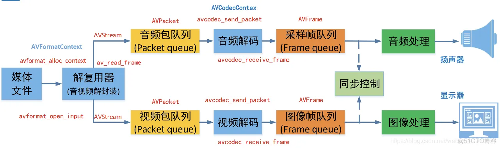
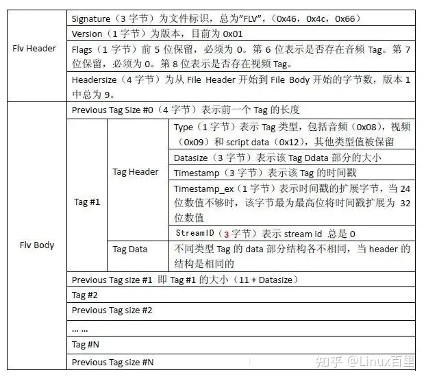

# <center>音视频学习笔记 </center>

## 零、 vscode

### 配置cmake
在c_cpp_properties.json中加入这一行

`"configurationProvider": "ms-vscode.cmake-tools"`

### WORKING_DIRECTORY
`set_target_properties(${EXECUTABLES} PROPERTIES WORKING_DIRECTORY ${CMAKE_SOURCE_DIR} RUNTIME_OUTPUT_DIRECTORY ${CMAKE_SOURCE_DIR})
`

## 一、 FFmpeg

### ffmpeg九宫格

```powershell
ffmpeg -i 1.mp4 -i 1.mp4 -i 1.mp4 -i 1.mp4 -filter_complex "nullsrc=size=1280x720[base];[0:v]setpts=PTS-STARTPTS,scale=640x360[lu];[1:v]setpts=PTS-STARTPTS,scale=640x360[ru];[2:v]setpts=PTS-STARTPTS,scale=640x360[ld];[3:v]setpts=PTS-STARTPTS,scale=640x360[rd];[base][lu]overlay=shortest=1[tmp1];[tmp1][ru]overlay=shortest=1:x=640[tmp2];[tmp2][ld]overlay=shortest=1:y=360[tmp3];[tmp3][rd]overlay=shortest=1:x=640:y=360" -y out.mp4
```

### FFmpeg内存模型



### AVPacket 相关

```c
AVPacket *av_packet_alloc(void);
void av_packet_free(AVPacket **pkt);
AVPacket *av_packet_clone(const AVPacket *src);
int av_new_packet(AVPacket *pkt, int size);
int av_packet_ref(AVPacket *dst, const AVPacket *src);
void av_packet_unref(AVPacket *pkt);
void av_packet_move_ref(AVPacket *dst, AVPacket *src);
int av_packet_make_refcounted(AVPacket *pkt);
```
流程在[test1](/ffmpegTester.cpp)中

### AVFormat 相关

```c
int avformat_open_input(AVFormatContext **ps, const char *url,
                        const AVInputFormat *fmt, AVDictionary **options);
void av_dump_format(AVFormatContext *ic,
                    int index,
                    const char *url,
                    int is_output);
AVPacket *av_packet_alloc(void);
int av_read_frame(AVFormatContext *s, AVPacket *pkt);
int av_seek_frame(AVFormatContext *s, int stream_index, int64_t timestamp, int flags);
```

### AVBitStreamFilter 相关

```c
// Query
const AVBitStreamFilter *av_bsf_next(void **opaque);
const AVBitStreamFilter *av_bsf_get_by_name(const char *name);

// Setup
int av_bsf_alloc(const AVBitStreamFilter *filter, AVBSFContext **ctx);
int av_bsf_init(AVBSFContext *ctx);

// Usage
int av_bsf_send_packet(AVBSFContext *ctx, AVPacket *pkt);
int av_bsf_receive_packet(AVBSFContext *ctx, AVPacket *pkt);

// Cleanup
void av_bsf_free(AVBSFContext **ctx);
```
在test3

### AAC提取PCM

[AAC提取PCM](https://blog.csdn.net/m0_37599645/article/details/112286537)

在[parse_pcm.cpp](src/parse_pcm.cpp)中

播放：`ffplay -ar 48000 -ac 2 -f f32le test.pcm`

### H264提取YUV420P

[H264提取YUV420P](https://blog.csdn.net/asdasfdgdhh/article/details/109777820)

在[parse_yuv420p.cpp](src/parse_yuv.cpp)中

播放: `ffplay -pixel_format yuv420p -video_size 1280x720  -i test.yuv`

## 二、 SDL

直接下载[SDL2](https://github.com/libsdl-org/SDL/releases)，然后用cmake引入就可以使用


## 三、 格式

### FLV



[FlvParser](https://blog.csdn.net/weixin_41643938/article/details/124537035)


### MP4

[mp4](https://zhuanlan.zhihu.com/p/355803589)